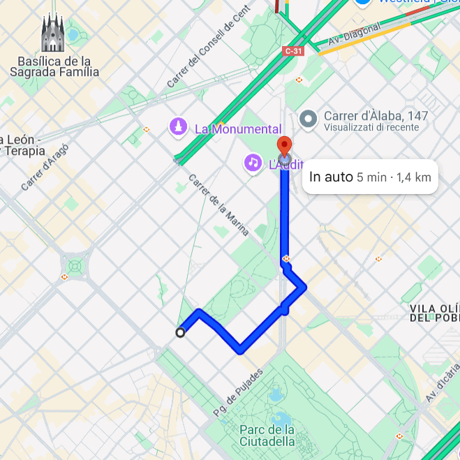

<div align="center">
  <h1>Shortest Path Stability in Urban Road Networks</h1>
  <h3>A framework to measure how sensitive routes are to small perturbations in destination</h3>
</div>

### Authors:

* Giuliano Cornacchia <sup>1</sup> [](https://orcid.org/0000-0003-2263-7654)  
* Mirco Nanni <sup>1</sup> [](https://orcid.org/0000-0003-3534-4332)

<sup>1</sup> ISTI-CNR, Pisa, Italy  

____

📄 *Article coming soon*

____

## Built with


### Requirements

Tested with:

- 

---

## Overview

This project implements the methodology presented in our article *"The path is the goal: A study on the nature and effects of shortest-path stability under perturbation of destination"* which introduces **Shortest Path Stability** as a measure of how sensitive shortest paths are to small perturbations in destination location.

It allows researchers to:
- Simulate controlled displacements around destinations.
- Measure how often and how drastically routes change.
- Compare the stability of shortest paths across different cities and spatial regions.

---

## What is Shortest Path Stability?

Given a small displacement of your destination (e.g., 50m to the left), does your optimal route change completely? **Shortest Path Stability** quantifies how stable optimal routes are to such minor shifts.

We use:
- **Controlled radial sampling** around a city center.
- **Displacement intervals** and **angular sectors** to perturb destination locations.
- **Weighted Jaccard similarity** to compare the original and perturbed routes.

<p align="center">
  
</p>

---

## Outputs

- `generated_routes.lz4`: Compressed dictionary of shortest paths.
- `sampling_info.json`: Metadata on sampled points and OD pairs.
- `weighted_jaccards.json`: Route stability scores.
- `fig_sampling.pdf`: Visualization of radial sampling layout.

---

## Parameters Table for `compute_sps.py`

| Short | Long           | Description                                                                                 | Required | Default                        |
|-------|----------------|---------------------------------------------------------------------------------------------|----------|--------------------------------|
| `-c`  | `--city`       | Name of the city used to load the corresponding road network.                              | ✅       | —                              |
| `-i`  | `--identifier` | Unique experiment identifier used for result folder naming.                                | ✅       | —                              |
|       | `--lat`        | Latitude of the city center.                                                                | ✅       | —                              |
|       | `--lng`        | Longitude of the city center.                                                               | ✅       | —                              |
| `-f`  | `--rfrom`      | Starting radius (in km) for radial sampling.                                               | ❌       | `1`                            |
| `-t`  | `--rto`        | Ending radius (in km) for radial sampling.                                                 | ❌       | `30`                           |
| `-s`  | `--rstep`      | Step size (in km) for radii used in sampling.                                              | ❌       | `1`                            |
| `-n`  | `--ncircles`   | Number of evenly spaced samples per circle (i.e., OD pairs per radius).                    | ❌       | `36`                           |
| `-d`  | `--thdist`     | Minimum distance (in km) between sampled points.                                           | ❌       | `0.5`                          |
| `-p`  | `--perturbations` | Dash-separated list of displacement boundaries in meters (e.g., `0-100-200`). Intervals are defined between each pair. | ❌ | `0-100-200-300-400-500` |
|       | `--nsectors`   | Number of angular sectors for destination perturbation (per displacement ring).           | ❌       | `8`                            |
| `-r`  | `--saveroutes` | Whether to save the generated routes (1 = Yes, 0 = No).                                    | ❌       | `0`                            |
|       | `--njobs`      | Number of parallel jobs for computation.  

---

Example Command:
```bash
python compute_sps.py -c pisa --lat 43.715906 --lng 10.401866 -i sps_pisa -f 1 -t 10 -s 1 -n 6 -d 0.5 -p 0-100-200-300 --nsectors 8 -r 1 --njobs 4
```


## Repository Structure

- `compute_sps.py`: Main script to compute SPS metrics.
- `compute_sps_city.py`: Batch callable function for cities.
- `sps_utils.py`: Utility functions for sampling, path generation, and stability computation.
- `notebooks/`: Jupyter notebooks for running and visualizing experiments.
